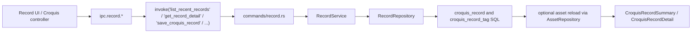

[[00 - Tauri Backend Overview|백엔드 허브로 돌아가기]]

# Croquis Records

> [!abstract] 문서 목적
> 크로키 record의 생성, 수정, 시작/종료 처리, 태그 연결, 결과 asset 연결 흐름을 정리한다.

## 1. Feature 개요

크로키 작업 결과를 `croquis_record` 로 관리한다. 세션 내부 step record 생성, 단독 record 저장, 시작/종료 시각 기록, 결과 asset 연결, 태그 관리가 모두 여기로 모인다.

## 2. Pipeline 정리

```text
Frontend에서 최근 기록 조회/상세 조회/저장/삭제/시작/종료/태그수정 호출
-> invoke('list_recent_records' | 'get_record_detail' | 'save_croquis_record' | ...)
-> commands/record.rs
-> RecordService
-> RecordRepository
-> croquis_record / croquis_record_tag / asset 관련 SQL 실행
-> 필요 시 source/result asset 재로딩
-> CroquisRecordSummary 또는 CroquisRecordDetail 반환
```



캡처 완료 시에는 `CaptureService` 가 `attach_result_asset()` 또는 `save_record()` 를 호출해 record를 갱신한다.

## 3. 코드 구조 매핑

### 3.1 Command Layer

- 파일: `apps/desktop/src-tauri/src/commands/record.rs`
- 주요 함수
  - `list_recent_records`
  - `get_record_detail`
  - `save_croquis_record`
  - `delete_croquis_record`
  - `start_croquis_record`
  - `finalize_croquis_record`
  - `update_croquis_record_tags`

### 3.2 Service / Business Logic

- 파일: `apps/desktop/src-tauri/src/services/record_service.rs`
- 주요 메서드
  - `list_recent_records`
  - `get_record`
  - `save_record`
  - `delete_record`
  - `update_record_tags`
  - `mark_record_started`
  - `finalize_record`
  - `attach_result_asset`
- 역할: record domain orchestration

### 3.3 Repository / DB Layer

- 파일: `apps/desktop/src-tauri/src/repositories/record_repository.rs`
- 주요 메서드
  - `list_recent`
  - `get_detail`
  - `save`
  - `delete`
  - `update_tags`
  - `mark_started`
  - `finalize`
  - `attach_result_asset`
- 역할
  - record 본문/태그 조회
  - 시작/종료 시각 기록
  - result asset 연결

- 파일: `apps/desktop/src-tauri/src/repositories/asset_repository.rs`
- 주요 메서드
  - `get_summary`
- 역할
  - record detail 응답에 source/result asset summary 결합

### 3.4 File System Layer

- 직접 파일 처리 없음

### 3.5 Shared State

- 파일: `apps/desktop/src-tauri/src/state/mod.rs`
- 주요 값
  - `pool`

## 4. API 정리

| Command                      | 입력 파라미터                             | 반환 타입                                   | 프론트 호출 방식                 | 설명                                     |
| ---------------------------- | ----------------------------------------- | ------------------------------------------- | -------------------------------- | ---------------------------------------- |
| `list_recent_records`        | `limit: Option<i64>`                      | `Result<Vec<CroquisRecordSummary>, String>` | `ipc.record.listRecent(limit)`   | 최근 record 목록 조회                    |
| `get_record_detail`          | `record_id: String`                       | `Result<CroquisRecordDetail, String>`       | `ipc.record.getDetail(recordId)` | record + source/result asset + 태그 조회 |
| `save_croquis_record`        | `payload: SaveCroquisRecordPayload`       | `Result<CroquisRecordDetail, String>`       | `ipc.record.save(payload)`       | record 생성 또는 수정                    |
| `delete_croquis_record`      | `payload: DeleteCroquisRecordPayload`     | `Result<(), String>`                        | `ipc.record.delete(payload)`     | record 삭제                              |
| `start_croquis_record`       | `record_id: String`                       | `Result<CroquisRecordDetail, String>`       | `ipc.record.start(recordId)`     | `started_at` 최초 기록                   |
| `finalize_croquis_record`    | `payload: FinalizeCroquisRecordPayload`   | `Result<CroquisRecordDetail, String>`       | `ipc.record.finalize(payload)`   | `finished_at`, `finalized_at` 갱신       |
| `update_croquis_record_tags` | `payload: UpdateCroquisRecordTagsPayload` | `Result<CroquisRecordDetail, String>`       | `ipc.record.updateTags(payload)` | record 태그 매핑 전체 교체               |

## 5. 추적 포인트

### 5.1 Frontend IPC 진입점

- 집계 객체: `apps/desktop/src/shared/lib/ipc.ts`
- feature wrapper: `apps/desktop/src/shared/lib/ipc/record.ts`
- 대표 UI 진입점
  - `apps/desktop/src/features/library/panels/RecordDetailPanel.tsx`
  - `apps/desktop/src/features/croquis/lib/useCroquisSessionController.ts`

### 5.2 관련 모델

- 파일: `apps/desktop/src-tauri/src/models/record.rs`
- 주요 타입
  - `CroquisRecordSummary`
  - `CroquisRecordDetail`
  - `SaveCroquisRecordPayload`
  - `FinalizeCroquisRecordPayload`
  - `UpdateCroquisRecordTagsPayload`

- 관련 asset summary
  - `apps/desktop/src-tauri/src/models/asset.rs`

### 5.3 관련 테이블

- `croquis_record`
- `croquis_record_tag`
- 간접 사용
  - `asset`
  - `tag`

### 5.4 구현상 동작 포인트

- `save_record()` 는 수정 시 `note = COALESCE(?8, note)` 를 사용하므로, `note: None` 이면 기존 note를 유지한다.
- 신규 저장 시 title이 비어 있으면 `step_name` 또는 `"Croquis Record"` 를 기본값으로 사용한다.
- `mark_record_started()` 는 `started_at` 이 없을 때만 최초 시각을 기록한다.
- `finalize_record()` 는 duration 값이 있으면 title 끝에 `(<n>s)` suffix를 한 번만 붙인다.
- `attach_result_asset()` 는 결과 asset를 연결하면서 `finished_at` / `finalized_at` 을 갱신하지만, 현재 `actual_duration_seconds` 값 자체는 저장하지 않는다.
- record 관련 DB 조회와 쓰기는 전부 `RecordRepository` 안의 SQLx 매크로로 정의된다.
- command layer는 `RecordService` 에 직접 연결되고, 공통 문자열 변환은 `apps/desktop/src-tauri/src/errors.rs` 의 `CommandResult` / `IntoCommandResult` 로 정리된다.
